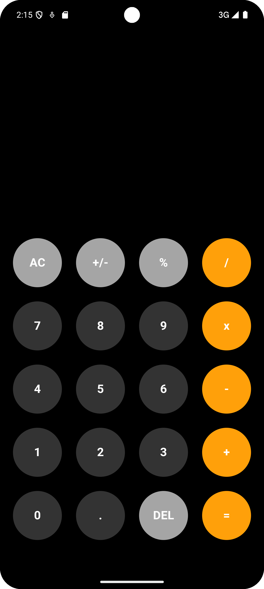
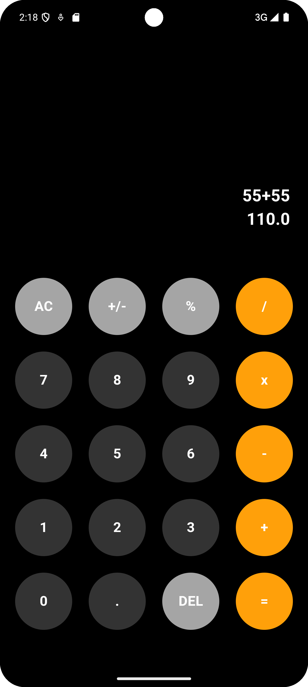

# Flutter Calculator App

This is a simple calculator application built using Flutter. It includes basic arithmetic operations and has a minimalistic UI.

## Features
- Addition, Subtraction, Multiplication, and Division
- Clean and simple UI
- Uses the `math_expressions 2.6.0` package for expression parsing

## Screenshots

| Main UI | Result Screen |
|---------|---------------|
|  |  |

## Packages Used
- `math_expressions: ^2.6.0`

## How to Run

1. Clone the repository.
2. Run `flutter pub get` to install the dependencies.
3. Run `flutter run` to launch the app.

---

Happy Coding!
